<div align="center">


<h1>개발자를 위한 커뮤니티가 여러분을 찾아갑니다</h1>
<h3>개발 능력 업그레이드를 DevPath와 함께!</h3>


</div>
<br><br>
<h1>🔍 목차</h1>

<table>
  <tr>
    <td>
      <b>1️⃣ We are FreePath</b>
        <ul>
          <li><a href="#team">✨ Team FreePath profile</a></li>
          <li><a href="#devtools">🛠️ Dev tools</a></li>
        </ul>
    </td>
  </tr>
  <tr>
    <td>
      <b>️2️⃣ Project Result</b>
       <ul>
          <li><a href="#figma">🙌 화면 설계서 (Figma)</a></li>
          <li><a href="#test">🎖️ 테스트 결과 보고서</a></li>
          <li><a href="#featuresheet">📋 기능 명세서</a></li>
        </ul>
    </td>
  </tr>
  <tr>
    <td>
      <b>3️⃣ Our Notion Page</b>
        <ul>
          <li><a href="#ournotionpage">📓 Notion Page Link</a></li>
        </ul>
    </td>
  </tr>
</table>

<br>

<h1>1️⃣ We are FreePath</h1>

<h3><span id="team">✨ Team FreePath profile</span></h3>

<div align="center">

|                        **김운경**                        |                        **김태인**                        |                        **이기연**                        |
|:-----------------------------------------------------:|:-----------------------------------------------------:|:-----------------------------------------------------:|
|  |  |  |
|       [@splguyjr](https://github.com/splguyjr)        |      [@Taein5415](https://github.com/Taein5415)       |    [@Lee-gi-yeun](https://github.com/Lee-gi-yeun)     |

|                        **이주미**                        |                        **이채은**                        |                        **하채린**                        |
|:-----------------------------------------------------:|:-----------------------------------------------------:|:-----------------------------------------------------:|
| 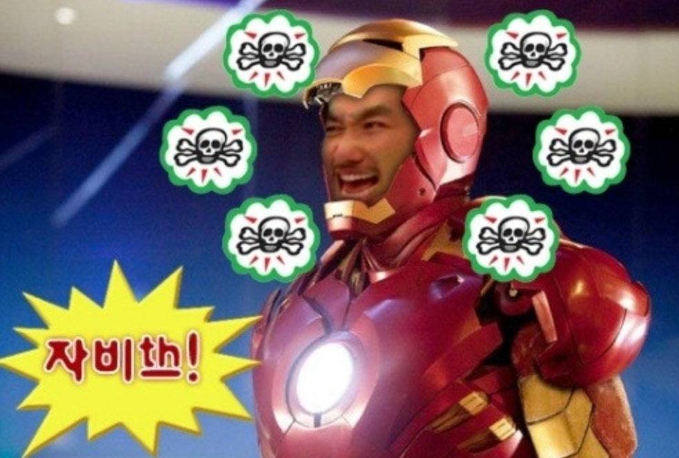 |  |  |
|        [@z00m-1n](https://github.com/z00m-1n)         |        [@nineeko](https://github.com/nineeko)         |         [@didiha](https://github.com/didiha)          | 

</div>

<br>
<h3 id="devtools">🛠️ Dev tools</h3>

<h4>📂 Database</h4>
<div>
  
  
  
  
</div>

<!-- Infrastructure -->
<h4>☁️ Infrastructure</h4>
<div>
  
   
  
</div>

<!-- Backend -->
<h4>🚀 Backend</h4>
<div>
  
  
  
</div>

<h4>🚀 Frontend</h4>
<div>
  
  
  
  
  
  
  
</div>

<!-- Tools -->
<h4>🛠️ Tools</h4>
<div>
  
  
  
  
  
</div>

<!-- Communication -->
<h4>💬 Communication</h4>
<div>
  
  
</div>

<br><br>

<h3><b>프로젝트 목적</b></h3>
프로젝트 <b>DevPath</b>는 비전공자와 주니어 개발자들이 실전 준비 과정에서 겪는 단절을 해소하고자 합니다. 구조화된 피드백과 동료와의 협업, 성장 추적 기능을 통해 지속적인 성장을 지원합니다. 이를 통해
단편적인 정보 소비를 넘어 자기 주도적 학습과 회고가 가능한 환경을 제공합니다.
<br><br>
<details>
  <summary><b><span style="font-size: 1.2em">프로젝트 구조</span></b></summary>

```angular2html

src/
├── api/
│   └── axios.js
├── assets/
│   ├── font/
│   └── images/ (board, chatting, common, csquiz, devti, interview, main, mypage, user)
│   └── styles/
├── components/
│   ├── common/
│   └── layout/ (Header, Sidebar, Sidebar Sections)
├── features/
│   ├── admin/
│   │   ├── csquiz, ItNews, report (각각 api.js, router.js, components/, views/)
│   ├── board/
│   │   ├── components/, views/, api.js, quill-config.js, router.js
│   ├── chatting/
│   │   ├── components/ (chattingView, userBlockView, ChattingPendingView), views/, api.js, router.js, stomp-client.js
│   ├── comment/
│   │   ├── components/, api.js
│   ├── csquiz/
│   │   ├── components/, views/, api.js, router.js
│   ├── devti/
│   │   ├── components/, views/, data/, api.js, router.js
│   ├── interaction/
│   │   └── components/, api.js
│   ├── interview/
│   │   ├── components/, views/, api.js, router.js
│   ├── main/
│   │   ├── components/, views/, api.js, router.js
│   ├── mypage/
│   │   ├── bookmark/, comment/, like/, reportedpost/, writepost/, views/, components/, api.js, router.js
│   └── user/
│       ├── components/, views/, api.js, errorcode.js, router.js
├── router/
│   └── index.js
└── stores/
└── auth.js

```

</details>
<br>

<h1 id="project-result">2️⃣ Project Result</h1>

<br>

<h1 id="figma">🙌 화면 설계서 (Figma)</h1>

<details>
  <summary><b>클릭해서 열기</b></summary>

### 👤 회원 관련 (회원가입 / 로그인 / 마이페이지)

<details>
<summary>회원가입 페이지</summary>


</details>

<details>
<summary>일반회원가입 페이지</summary>


</details>

<details>
<summary>소셜회원가입 페이지</summary>


</details>

<details>
<summary>로그인 페이지</summary>


</details>

<details>
<summary>로그인 - 일반 페이지</summary>


</details>

<details>
<summary>비밀번호 찾기</summary>


</details>

<details>
<summary>아이디 찾기</summary>


</details>

<details>
<summary>내 프로필 수정</summary>


</details>

<details>
<summary>마이페이지 게시글 모아보기</summary>

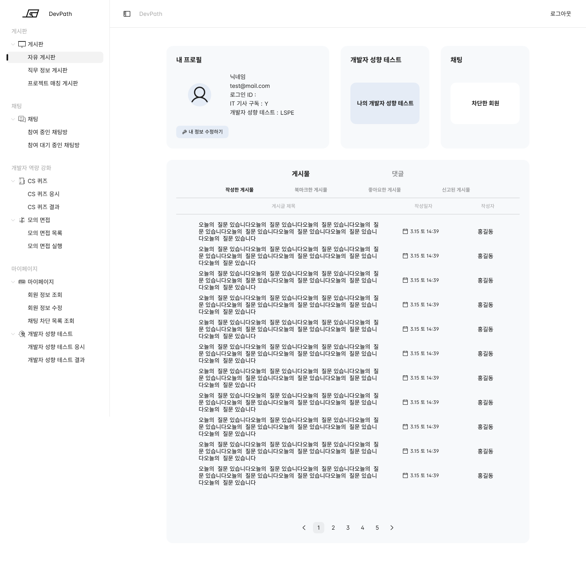

</details>

<details>
<summary>마이페이지 댓글 모아보기</summary>

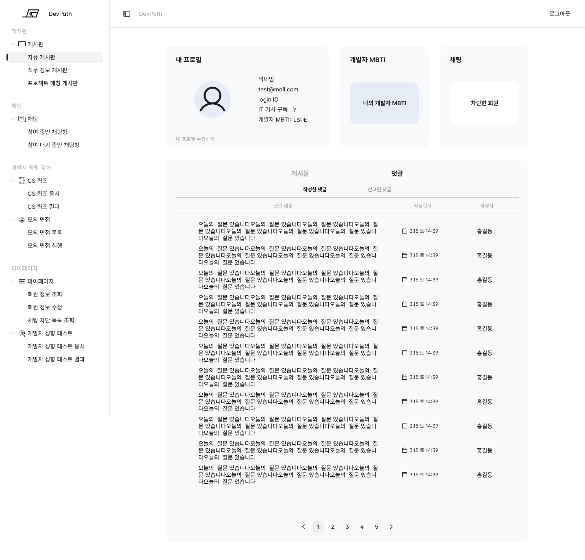

</details>

### 🏠 메인

<details>
<summary>메인 페이지 - 회원</summary>


</details>

<details>
<summary>메인 페이지 - 비회원</summary>


</details>

### 📝 게시판

<details>
<summary>게시글 목록</summary>


</details>

<details>
<summary>게시글 작성</summary>


</details>

<details>
<summary>게시글 상세조회</summary>


</details>

<details>
<summary>프로젝트 게시판 게시글 작성</summary>


</details>

### 🗣️ 채팅

<details>
<summary>일대일 채팅룸 목록 페이지</summary>


</details>

<details>
<summary>그룹채팅방 페이지</summary>


</details>

<details>
<summary>참여 대기중인 채팅방 목록 확인</summary>


</details>

<details>
<summary>채팅 차단 목록 조회 페이지</summary>


</details>

### 👔 면접 기능

<details>
<summary>면접방 목록 조회 (면접 초기 화면)</summary>


</details>

<details>
<summary>면접방 목록 조회 (면접이 존재하지 않을 때)</summary>


</details>

<details>
<summary>면접 실행 면접방 정보 선택</summary>


</details>

<details>
<summary>면접 실행 면접 진행(질답_3)</summary>


</details>

<details>
<summary>면접 조회 면접방 상세조회</summary>


</details>

<details>
<summary>면접재실행</summary>


</details>

<details>
<summary>면접재실행</summary>


</details>

### 📊 성향 테스트

<details>
<summary>성향테스트 초기 화면</summary>


</details>

<details>
<summary>개발자 성향 테스트 응시 화면</summary>


</details>

<details>
<summary>개발자 성향 테스트 결과 화면</summary>


</details>

<details>
<summary>개발자 성향 테스트 결과 종류</summary>


</details>

### 🧠 CS 퀴즈

<details>
<summary>CS 퀴즈 목록 조회</summary>


</details>

<details>
<summary>CS 퀴즈 응시 화면</summary>


</details>

<details>
<summary>CS 퀴즈 결과</summary>


</details>

### 🛠️ 관리자 관련 (신고 / CS 퀴즈 / IT 뉴스 기사)

<details>
<summary>관리자 홈</summary>


</details>

<details>
<summary>신고 검토 목록</summary>


</details>

<details>
<summary>신고 처리</summary>


</details>

<details>
<summary>cs 퀴즈 등록</summary>


</details>

<details>
<summary>cs 퀴즈 상세 조회</summary>


</details>


<details>
<summary>미 발송 된 기사 조회</summary>


</details>

<details>
<summary>발송 된 기사 조회</summary>


</details>

<details>
<summary>기사 작성</summary>


</details>


</details>

<br>
<h1 id="test">🎖️ 테스트 결과 보고서</h1>

<details>
  <summary><b>클릭해서 열기</b></summary>

### 👤 회원 테스트

<detail>

<details>
  <summary><b>회원</b></summary>

1. 일반 회원가입
   <br>
   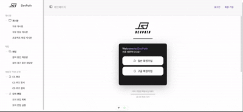
   <br>: 사용자는 일반 회원가입을 통해 계정을 생성할 수 있다.
   <br><br>

2. 구글 회원가입
   <br>
   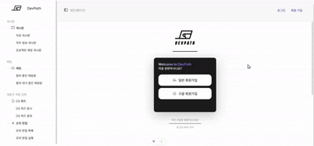
   <br>: 사용자는 구글 회원가입을 통해 계정을 생성할 수 있다.
   <br><br>

3. 일반 로그인
   <br>
   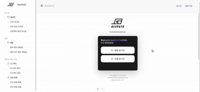
   <br>: 사용자는 일반 로그인을 통해 로그인을 할 수 있다.
   <br><br>

4. 구글 로그인
   <br>
   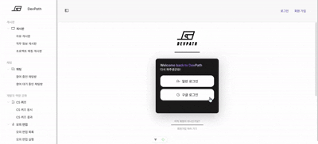
   <br>: 사용자는 구글 로그인을 통해 로그인을 할 수 있다.
   <br><br>

5. 로그아웃
   <br>
   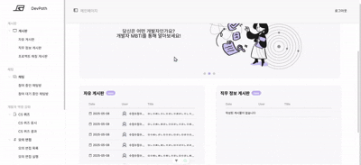
   <br>: 사용자는 헤더의 로그아웃 버튼을 통해 로그아웃을 할 수 있다.
   <br><br>

6. 로그인 ID 찾기
   <br>
   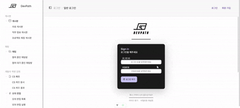
   <br>: 사용자는 로그인을 하지 않아도 이메일 인증을 통해 로그인 ID를 찾을 수 있다.
   <br><br>

7. 비밀번호 재설정
   <br>
   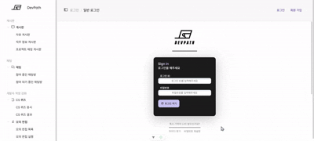
   <br>: 사용자는 로그인을 하지 않아도 이메일 인증을 통해 비밀번호를 재설정 할 수 있다.
   <br><br>

</details>

<details>
  <summary><b>마이페이지</b></summary>

1. 기본 정보 조회
   <br>
   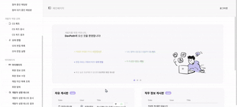
   <br>: 사용자는 마이페이지에서 본인의 이메일, 닉네임, 구독 여부 등을 조회할 수 있다.
   <br><br>

2. 게시글, 댓글 모아보기  
   <br>
   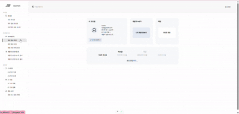
   <br>: 사용자의 게시글 및 댓글 목록을 확인할 수 있다.
   <br><br>

3. 일반 정보 수정
   <br>
   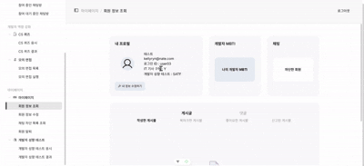
   <br>: 사용자는 닉네임, it 기사 구독 여부를 수정할 수 있다.
   <br><br>

4. 이메일 수정
   <br>
   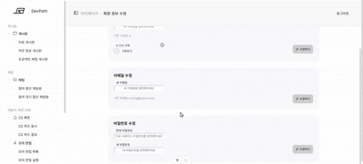
   <br>: 사용자는 이메일을 수정할 수 있다.
   <br><br>

5. 비밀번호 수정
   <br>
   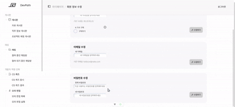
   <br>: 사용자는 비밀번호를 수정할 수 있다.
   <br><br>

</details>

<details>
  <summary><b>메인 페이지</b></summary>

   1. 메인 페이지
   <br>
   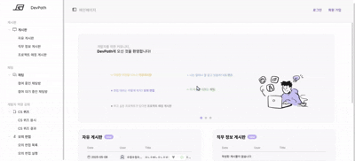
   <br>: 사이트 소개 네비게이션 상호작용과 아래의 게시글 리스트 클릭 시 해당 게시물로 이동할 수 있다.
   <br><br>
</details>

</detail>
<br>

### 📝 게시글 테스트

<details>
<summary><b>게시판 기능 테스트</b></summary>

<br>

1. 게시판 목록 조회  
   <br>
   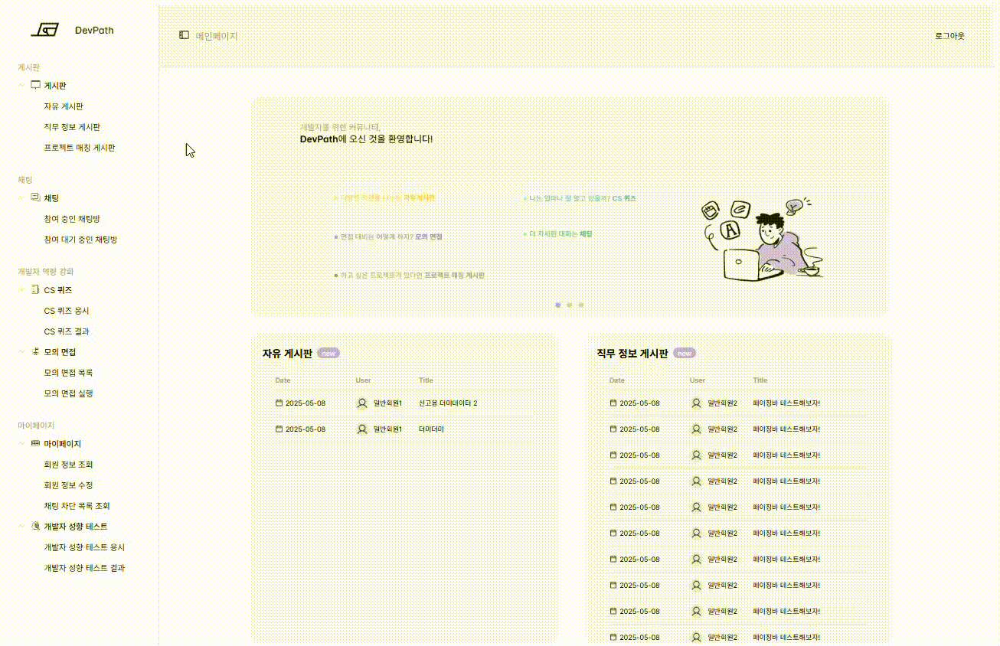  
   <br>: 게시판에 등록된 게시글 목록을 조회할 수 있다.<br><br>

2. 게시글 검색  
   <br>
   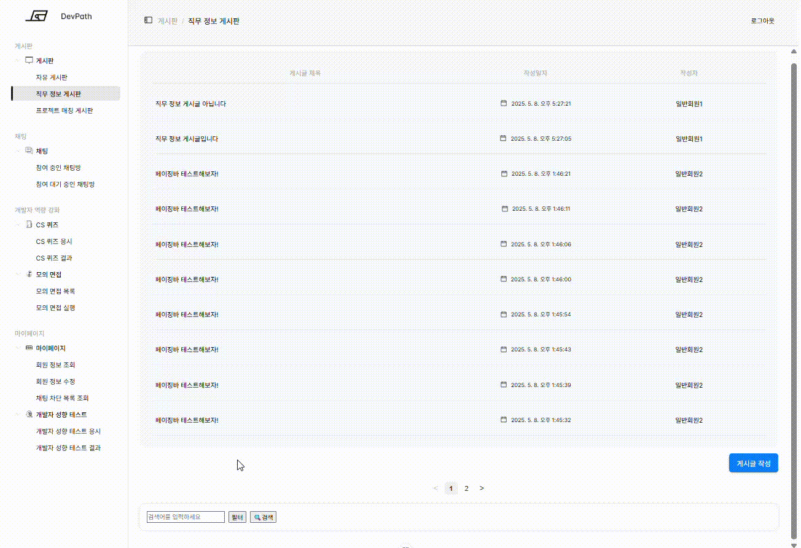  
   <br>: 키워드를 통해 게시글을 검색할 수 있다.<br><br>

3. 게시글 상세 조회  
   <br>
   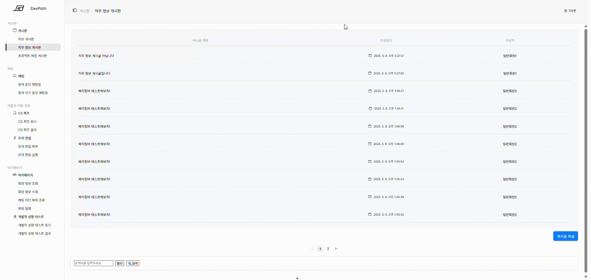  
   <br>: 게시글의 상세 내용을 확인할 수 있다.<br><br>

4. 게시글 작성  
   <br>
   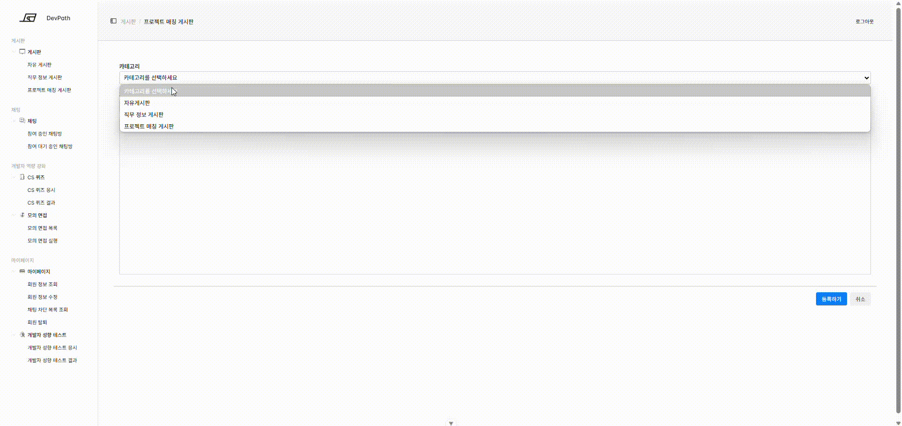  
   <br>: 새 게시글을 작성하여 게시판에 등록할 수 있다.<br><br>

5. 게시글 수정  
   <br>
   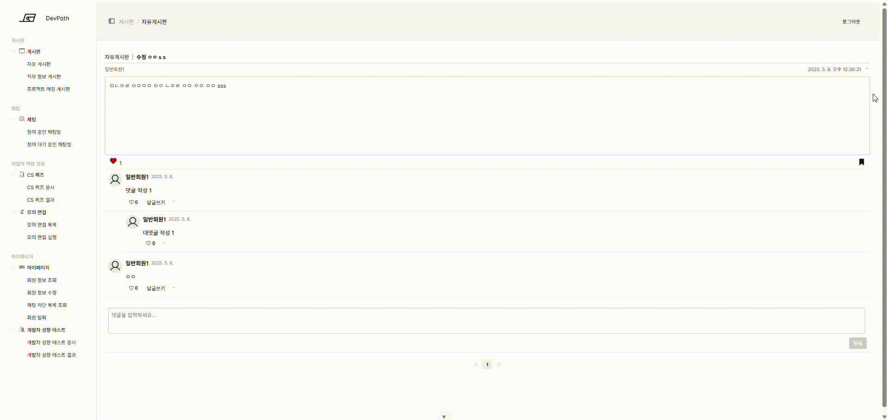  
   <br>: 작성한 게시글을 수정할 수 있다.<br><br>

6. 게시글 삭제  
   <br>
   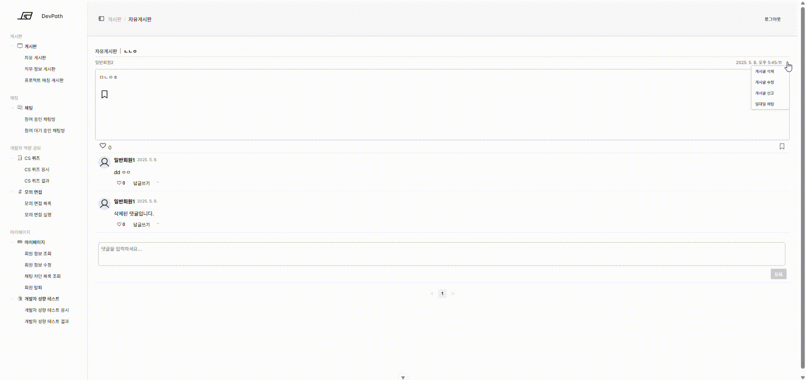  
   <br>: 작성한 게시글을 삭제할 수 있다.<br><br>

7. 댓글 및 대댓글 작성  
   <br>
   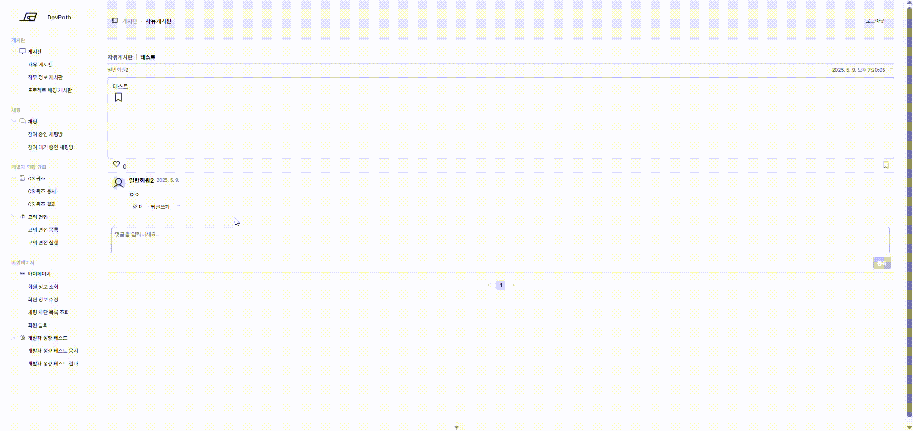  
   <br>: 게시글에 댓글과 대댓글을 작성할 수 있다.<br><br>

8. 댓글 삭제  
   <br>
   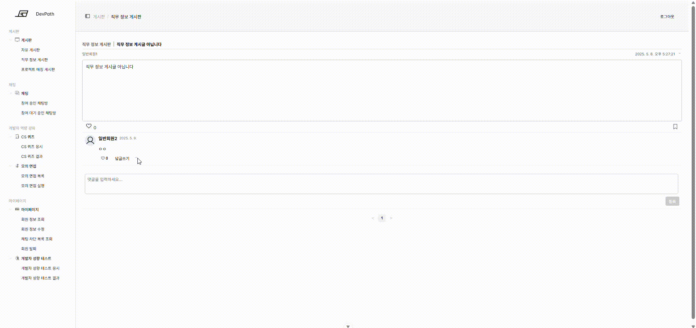  
   <br>: 작성한 댓글을 삭제할 수 있다.<br><br>
</details>


<br>

<br>

### 🔁 게시판 상호작용 테스트 (완)

<details>
  <summary><b>게시글 / 댓글 좋아요 및 북마크</b></summary>

1. 게시글 좋아요 / 북마크  
   <br>
   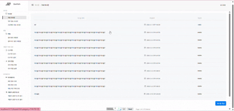
   <br>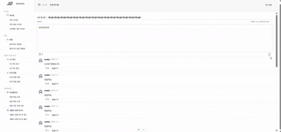
   <br>: 게시글에 대해 좋아요 및 북마크 기능을 사용할 수 있다.
   <br><br>

2. 댓글 좋아요 / 좋아요 취소
   <br>
   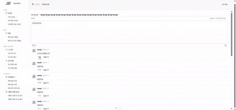
   <br>: 댓글에 대해서도 좋아요를 할 수 있다.
   <br><br>

3. 비회원 접근 제한  
   <br>
   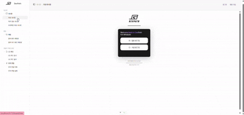
   <br>: 로그인하지 않은 사용자는 상호작용이 제한된다. 로그인 화면으로 이동된다.
   <br><br>

</details>

<br>

### 🎤 모의면접 테스트 (완)

<details>
   <summary><b>모의 면접 실행 기능</b></summary>

1. 면접방 정보 선택으로 새로운 면접방 생성
   <br>
   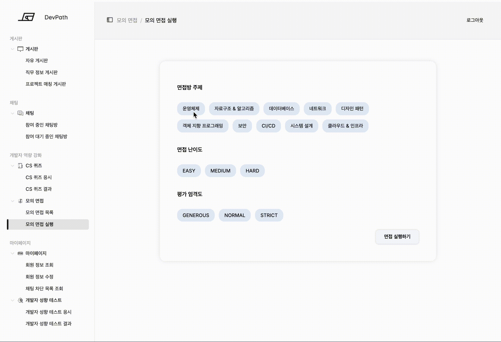
   <br>: 사용자는 면접방의 주제, 질문 난이도, 평가 엄격도를 선택해 새로운 면접방을 생성할 수 있다.
   <br><br>
2. 면접방 실행
   <br>
   
   <br>: 하나의 면접방에는 총 세 개의 질문이 주어지고, 사용자는 순서대로 도출되는 질문에 대해 답변을 할 수 있다. 첫 번째와 두 번째 질문에 대해 답변할 때는 다음 질문을 요청한다.
   <br><br>
3. 면접방 종료
   <br>
   
   <br>: 사용자는 마지막 질문에 대해 답변할 때 "다음 질문"이 아닌 "면접 종료" 버튼을 눌러 면접방을 종료한다. 면접방이 종료되면 해당 면접방의 결과를 상세조회 할 수 있다.
   <br><br>
4. 면접방 삭제
   <br>
   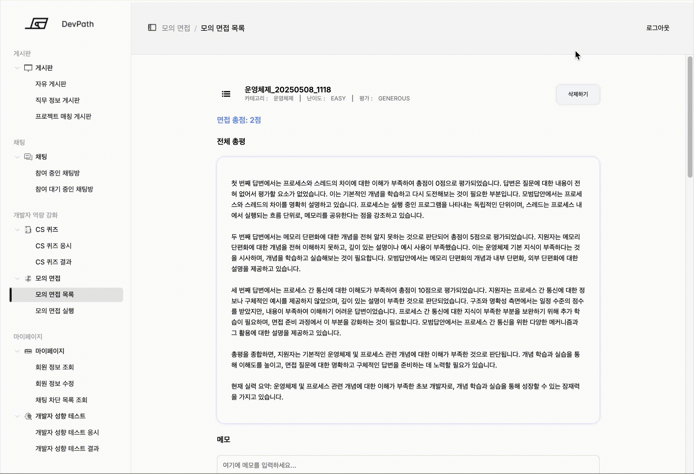
   <br>: 사용자는 본인이 진행한 면접방을 삭제할 수 있다.
   <br><br>
5. 면접방 정보 수정
   <br>
   
   <br>: 하나의 면접방에는 총 세 개의 질문이 주어지고, 사용자는 순서대로 도출되는 질문에 대해 답변을 할 수 있다. 첫 번째와 두 번째 질문에 대해 답변할 때는 다음 질문을 요청한다.
   <br><br>
6. 면접방 재실행
   <br>
   
   <br>: 기존의 면접방과 동일한 질문에 대해 새로운 답변을 하고 새로운 평가를 받고 싶을 때, 사용자는 본인이 진행했던 면접방을 재실행할 수 있다.
   <br><br>
7. 재실행된 면접방 조회
   <br>
   
   <br>: 사용자는 해당 면접방에 대해 재실행됐던 면접방을 조회할 수 있다.
   <br><br>

</details>
<br>
<details>
   <summary><b>모의 면접 조회 기능</b></summary>

1. 실행한 모의 면접 목록 조회
   <br>
   
   <br>: 사용자는 본인이 실행한 모의 면접의 목록을 조회할 수 있다.
   <br><br>
2. 실행한 모의 면접 목록 조회
   <br>
   
   <br>: 사용자는 본인이 실행한 모의 면접방을 상세조회할 수 있다.
   <br><br>

</details>
<br>

### 😎 DevTI : 개발자 성향 테스트

<details>
   <summary><b>DevTI : 개발자 성향 테스트</b></summary>

1. DevTI 테스트 실행
   <br>
   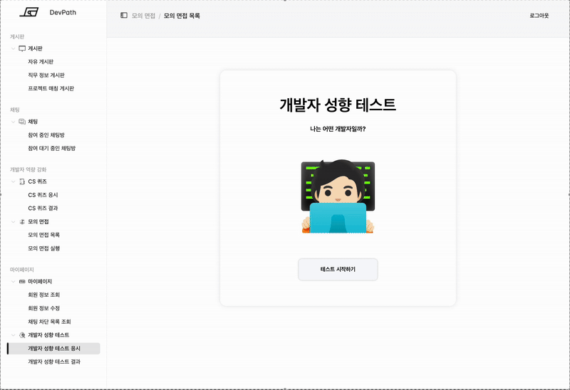
   <br>: 사용자는 DevTI 테스트를 실행할 수 있다.
   <br><br>
2. DevTI 결과 조회
    1) 실행하지 않은 상태로 결과를 조회할 때
       <br>
       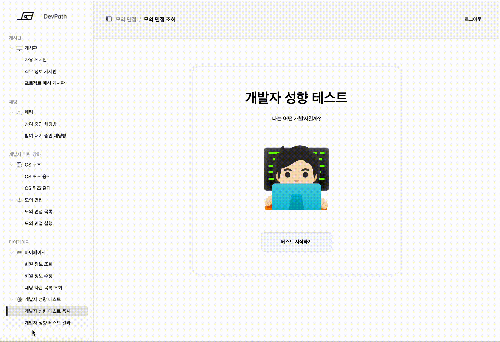
       <br>: 사용자는 DevTI를 실행하지 않은 상태로 결과를 조회할 수 없다.
       <br><br>
    2) 실행한 결과가 있는 상태로 결과를 조회할 때
       <br>
       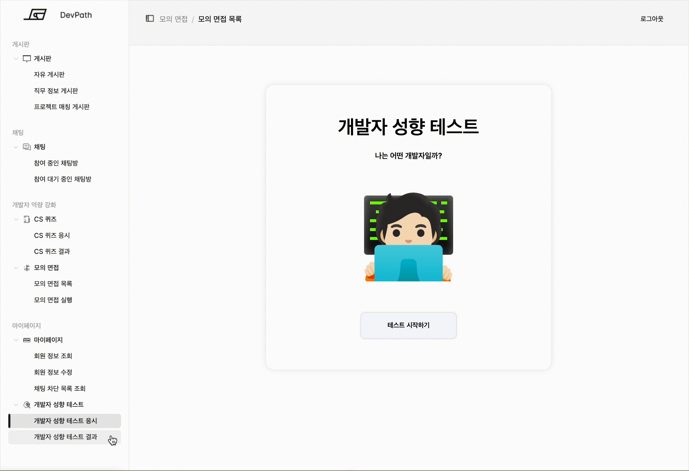
       <br>: 사용자는 본인의 DevTI의 결과를 상세 조회할 수 있다.
       <br><br>
3. DevTI 결과 공유
   <br>
   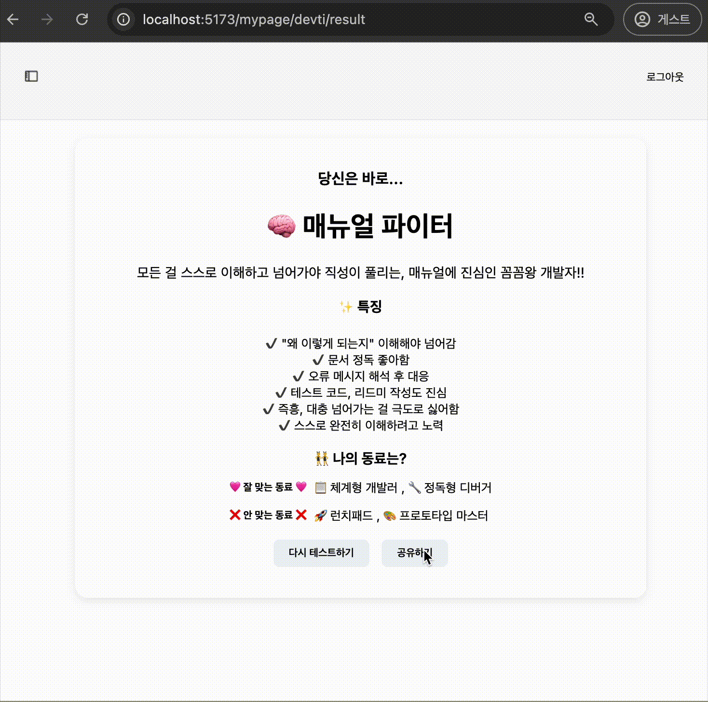
   <br>: 사용자는 본인의 DevTI 결과를 공유할 수 있다.
   <br><br>
4. 비회원의 공유된 DevTI 조회
   <br>
   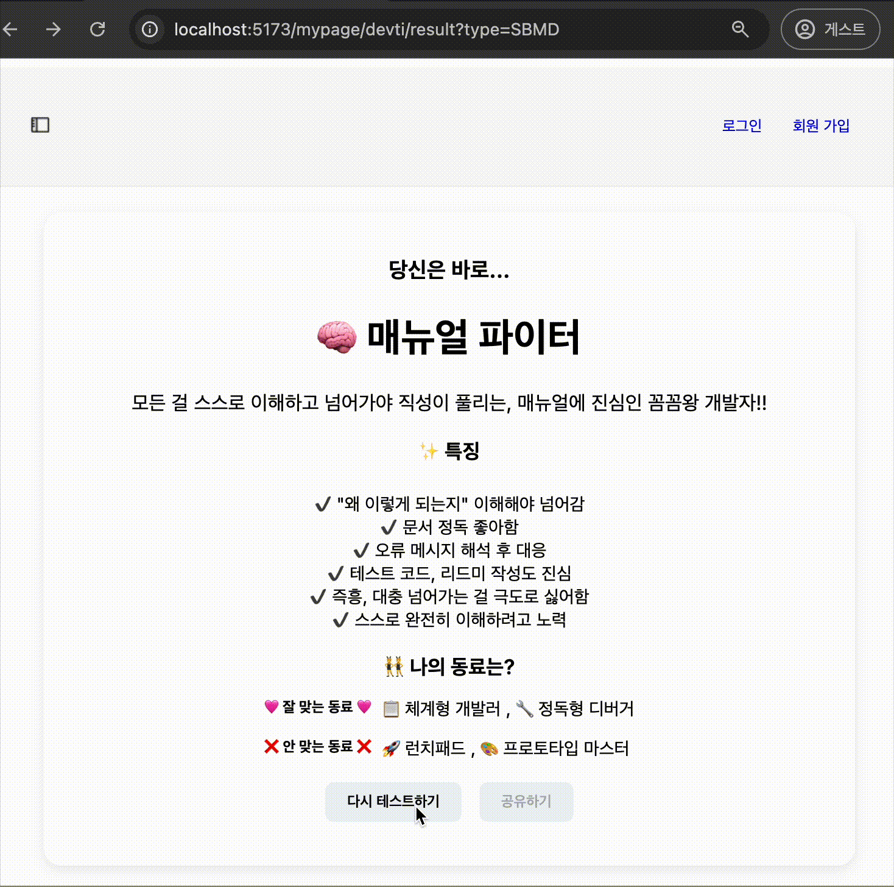
   <br>: 사용자는 공유된 DevTI 결과 링크로 회원의 결과를 조회할 수 있다.
   <br><br>

</details>
<br>

### 🧠 CS 퀴즈 테스트 (완)

<details>
  <summary><b>CS 퀴즈 응시 및 결과</b></summary>

1. 퀴즈 응시  
   <br>
   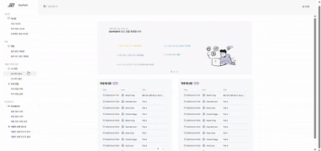
   <br>: 사용자는 주간 CS 퀴즈에 응시할 수 있다.
   <br><br>

2. 결과 확인  
   <br>
   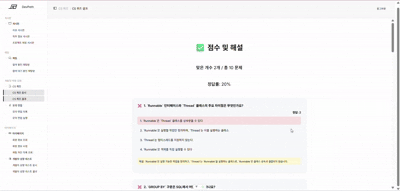
   <br>: 응시 완료 후 정오답 및 해설을 확인할 수 있다. 응시 후에 또 다시 응시하려 할 때 결과창으로 다시 이동하며 이미 답변이 완료되었다는 안내가 나온다.
   <br><br>

</details>

<br>

### 🛠️ 관리자 테스트 (완)

<details>
  <summary><b>관리자 기능</b></summary>

1. 접근 제한 (비회원 / 일반 사용자)  
   <br>
   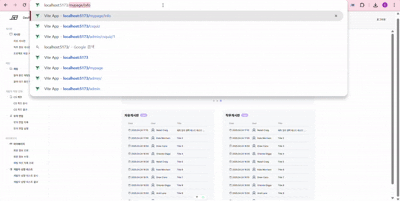
   <br>: 관리자 외에 다른 사람이 접근 시 접근이 차단된다.
   <br><br>

</details>

<details>
  <summary><b>관리자 CS 퀴즈 기능</b></summary>

1. 목록 조회  
   <br>
   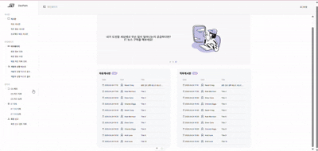
   <br>: 관리자는 CS퀴즈 목록을 조회할 수 있다. 누르면 상세 조회가 된다.
   <br><br>

2. 등록  
   <br>
   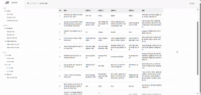
   <br>: 관리자는 CS퀴즈를 등록할 수 있다. 등록 시 모든 정보를 입력해야 하고, 정답은 1-4 사이만 입력할 수 있다. 그 외 입력 시 경고창이 뜬다.
   <br><br>

3. 상세 조회  
   <br>
   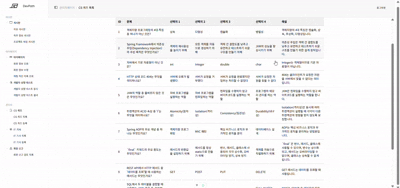
   <br>: 관리자는 CS퀴즈 상세 조회할 수 있다.
   <br><br>

4. 수정  
   <br>
   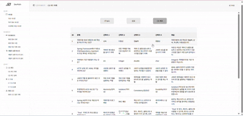
   <br>: 관리자는 CS퀴즈 상세 조회 시 수정할 수 있다. 원래 데이터에 변화가 생기는 순간 수정 버튼이 활성화된다.
   <br><br>

</details>
<details> <summary><b>관리자 IT 뉴스 기능</b></summary>
1. IT 기사 목록 전체 조회
<br>

<br>: 관리자는 IT 뉴스 목록을 조회할 수 있다.
<br><br>

2. 발송된 뉴스 조회
   <br>
   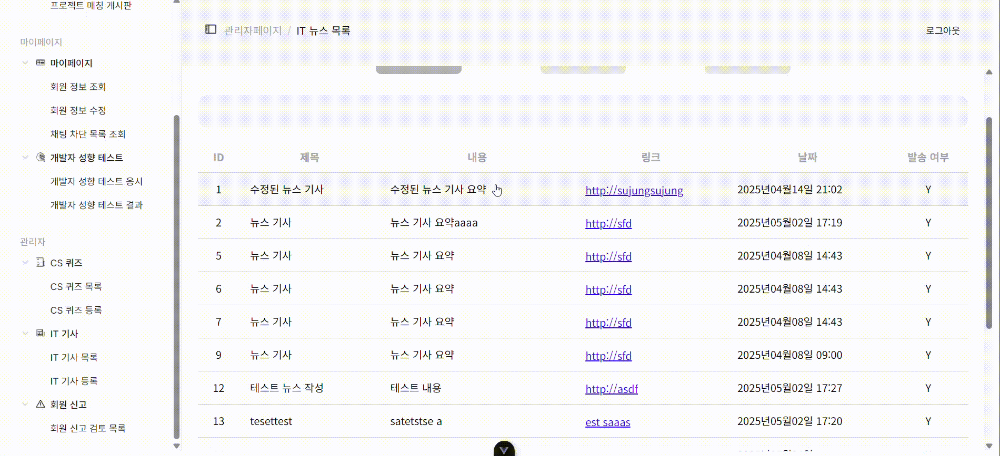
   <br>: 발송 완료된 뉴스 기사를 확인할 수 있다.
   <br><br>

3. 미발송 뉴스 조회 및 수정
   <br>
   
   <br>: 미발송 기사를 선택해 내용을 수정할 수 있다.
   <br><br>

4. 뉴스 작성
   <br>
   
   <br>: 관리자는 새로운 뉴스를 작성할 수 있다.
   <br><br>

5. 뉴스 수동 발송
   <br>
   
   <br>: 관리자는 원하는 시점에 수동 발송을 진행할 수 있다.
   <br><br>

6. 뉴스 삭제
   <br>
   
   <br>: 관리자는 불필요한 뉴스 기사를 삭제할 수 있다.
   <br><br>

7. 뉴스 목록 돌아가기
   <br>
   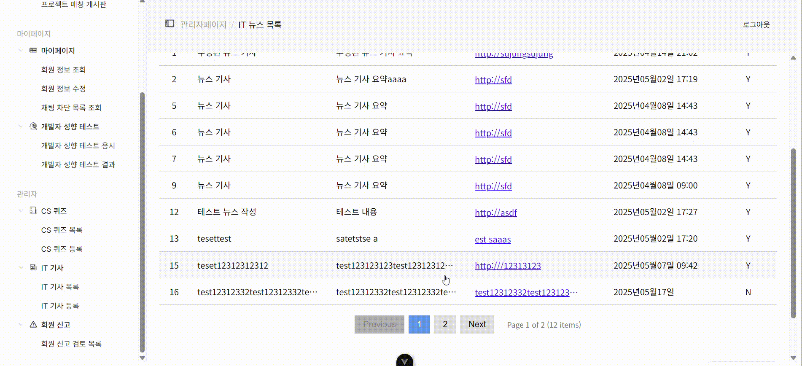
   <br>: 뉴스 상세 페이지에서 목록으로 다시 이동할 수 있다.
   <br><br>

</details>

<br><br>

### 💬 채팅 테스트(완)

<details>
    <summary><b>채팅방 기능</b></summary>
    1. 채팅방 생성
    <br>
    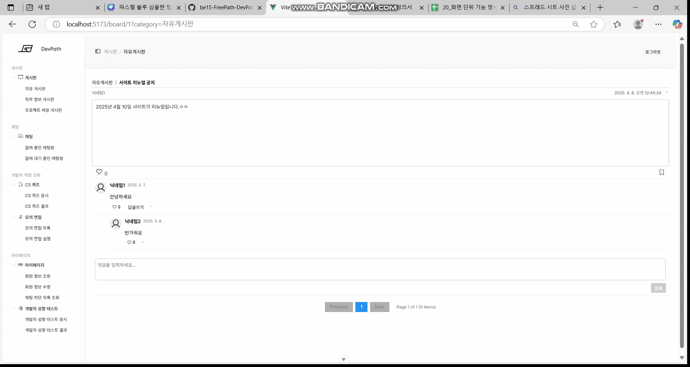
    <br>: 사용자 토큰을 이용하여 채팅방 생성
    <br><br>
    2. 그룹채팅방 생성
    <br>
    
    <br>: 게시글ID와 사용자 토큰을 이용해 그룹채팅방 생성
    <br><br>
    3. 채팅방 나가기
    <br>
    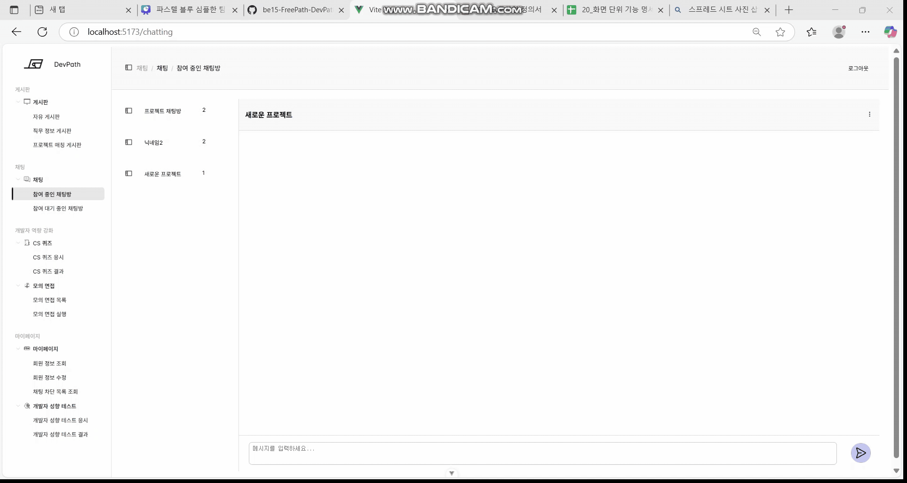
    <br>: 채팅방Id와 토큰을 이용해 채팅방을 나감
    <br><br>
    4. 채팅방 목록 조회
    <br>
    
    <br>: 참여중인 채팅방 목록을 조회한다.
    <br><br>
     5. 채팅 내역 조회
    <br>
    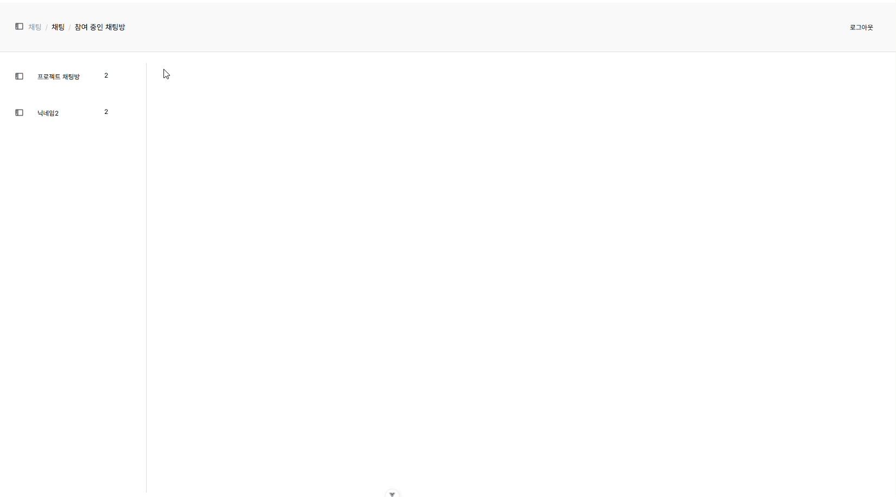
    <br>: 채팅방의 채팅 내역을 조회한다.
    <br><br>
    6. 채팅방 제목 변경
    <br>
    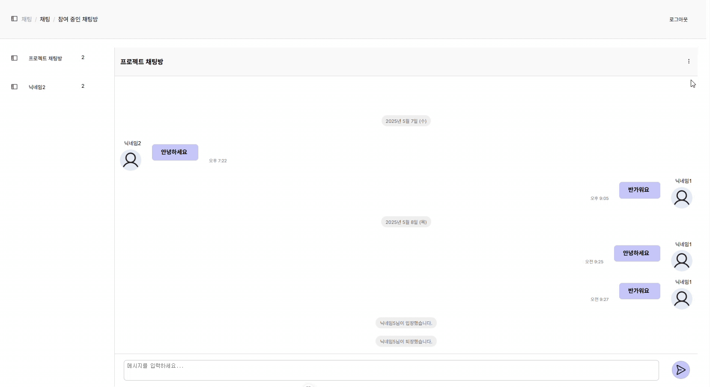
    <br>: 그룹채팅방의 OWNER가 채팅방의 제목을 수정한다.
    <br><br>
    7. 채팅방 참여자 목록 조회
    <br>
    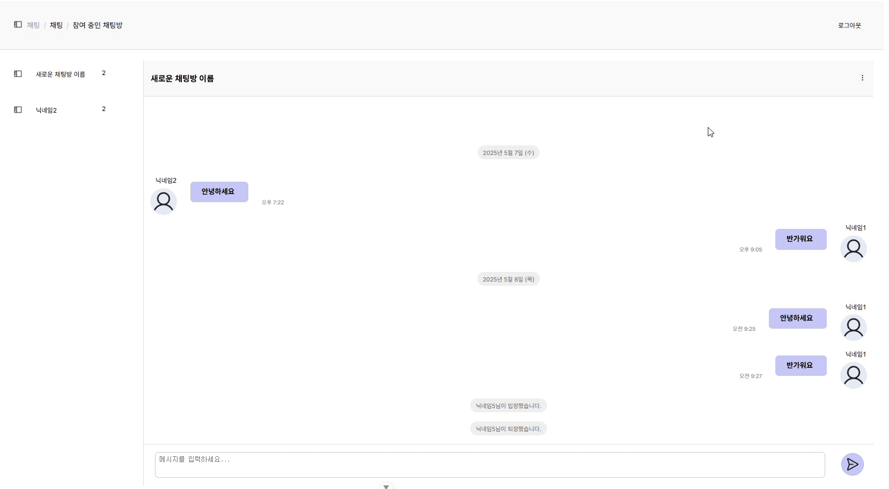
    <br>: 특정 채팅방의 참여자 목록을 조회할 수 있다.
    <br><br>
</details>
<details>
    <summary><b>차단 기능</b></summary>
    1. 회원 차단 기능
    <br>
    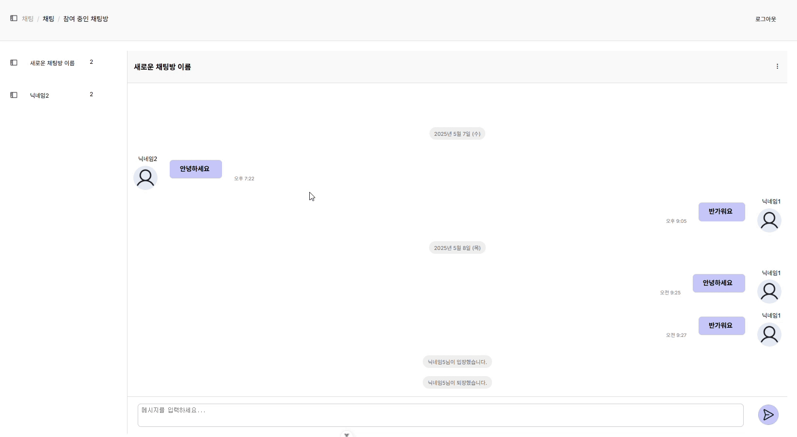
    <br>: 특정 사용자를 차단할 수 있다.
    <br><br>
    2. 회원 차단 취소 기능
    <br>
    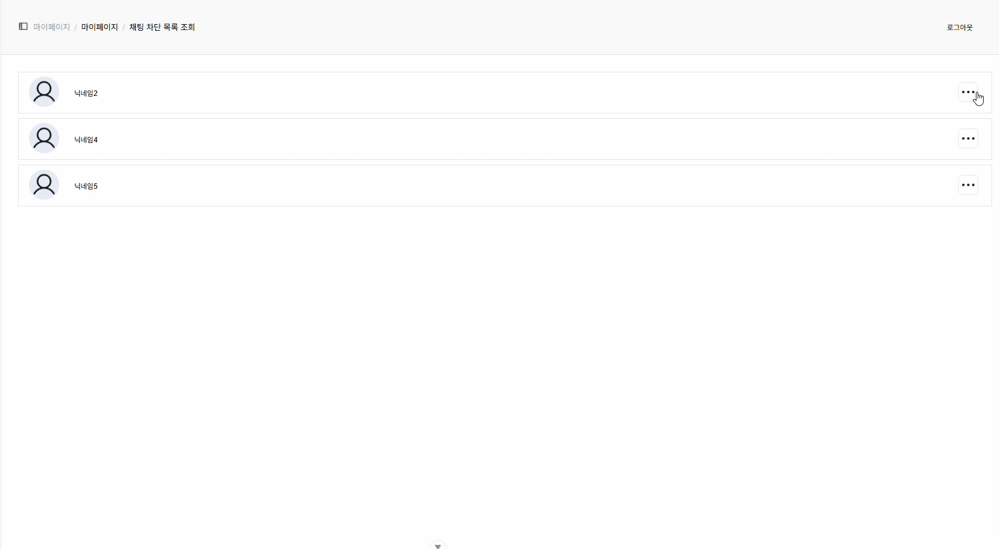
    <br>: 특정 사용자 차단을 취소할 수 있다.
    <br><br>
    3. 회원 차단 목록 조회
    <br>
    
    <br>: 사용자가 차단한 다른 사용자들을 조회할 수 있다.
    <br><br>
</details>
<details>
<summary><b>그룹채팅방 기능</b></summary>
    1. 그룹채팅방 참여 요청
    <br>
    
    <br>: 일반 사용자는 그룹채팅방 참여 요청을 보낸다.
    <br><br>
    2. 그룹채팅방 대기방 조회
    <br>
    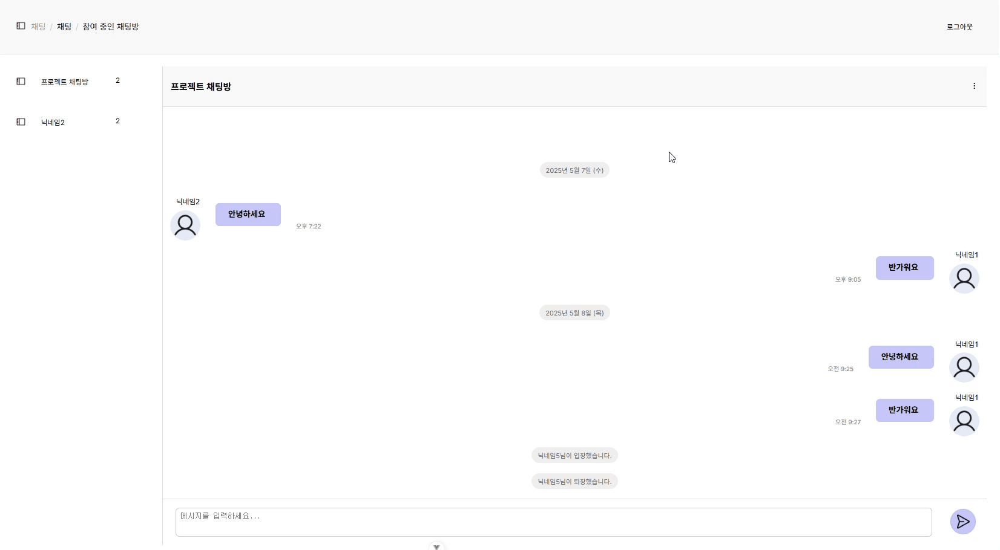
    <br>: 그룹채팅방의 OWNER는 대기방을 조회할 수 있다.
    <br><br>
    3. 그룹채팅방 요청 수락락
    <br>
    
    <br>: 그룹채팅방의 OWNER는 그룹채팅방 참여 요청을 수락할 수 있다.
    <br><br>
    3. 그룹채팅방 요청 수락
    <br>
    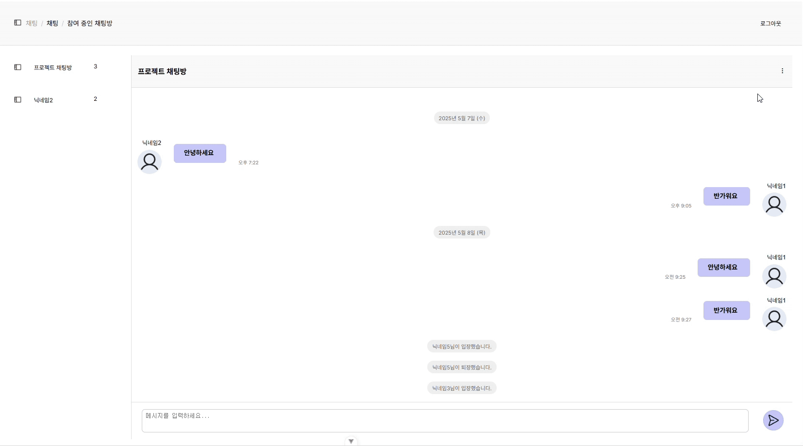
    <br>: 그룹채팅방의 OWNER는 그룹채팅방 참여 요청을 거절할 수도 있다.
    <br><br>
</details>
<details>
<summary><b>채팅 연결 테스트</b></summary>

    <br>: stomp를 이용하여 connect, subscribe, send시 사용자의 토큰을 확인하여 채팅방에 참여중인 사용자인지 확인한다. 
</details>

<br>


<br>

### 🚨 신고 테스트(완)

<details> <summary><b>신고 기능</b></summary>
1. 게시글 신고
<br>
 <br>: 사용자는 게시글을 신고할 수 있다. <br><br>
2. 댓글 신고
<br>
 <br>: 사용자는 댓글을 신고할 수 있다. <br><br>
3. 신고 조회 및 반려 처리
<br>
 <br>: 관리자는 신고된 내용을 조회하고 반려할 수 있다. <br><br>
4. 신고 조회 및 삭제 처리
<br>
 <br>: 관리자는 신고된 내용을 조회하고 해당 게시글이나 댓글을 삭제 처리할 수 있다. 
<br><br> 
</details>


<br>
</details>

<h1 id="featuresheet">📋 기능 명세서</h1>

<p>
  👉 <a href="https://docs.google.com/spreadsheets/d/1QiwmdboXW1NQqpaus8WPn9rSQqanZmAI-qdMtQAnVAA/edit?usp=sharing" target="_blank">
    기능 명세서 보기 (Google Sheets)
  </a>
</p>


<br>
<h1 id="ournotionpage">3️⃣ Our Notion Page</h1>
<a href="https://www.notion.so/be15_2nd_FreePath-DevPath-1b62fdb1414880c1903ad52d9dd08ac8?pvs=4"><text><strong>| 📓 Notion Page Link |</strong></text></a>
<br><br>

